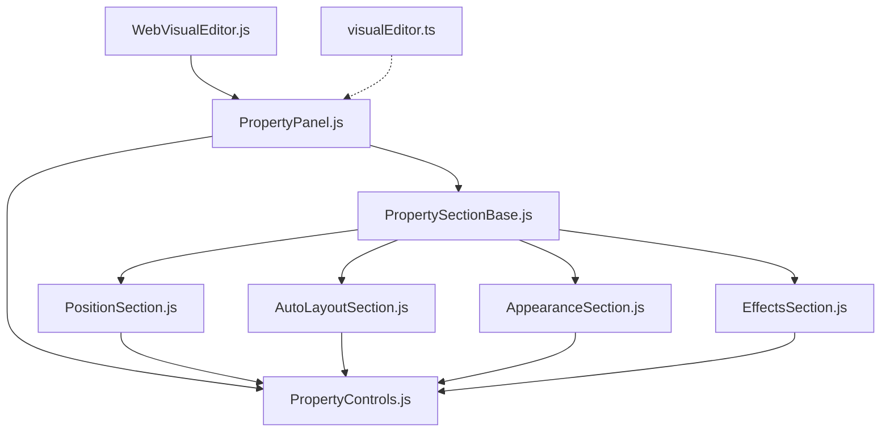

# Figma 风格属性面板开发指南

> **AI 开发上下文文档** - 用于指导后续属性面板功能的添加和修改

## 📋 项目概览

本项目实现了一个完全模块化的 Figma 风格属性面板系统，用于 VSCode HTML 可视化编辑器。该系统从原来的 1,786 行单文件 `ElementPanel.js` 重构为 7 个专门模块，提供 1:1 复刻 Figma 界面的用户体验。

## 🎯 架构设计

### 核心模块结构

```
webview/modules/ui/property-panel/
├── PropertyControls.js          # 通用控件库 (基础层)
├── PropertySectionBase.js       # 折叠区域基础类 (抽象层)
├── PositionSection.js          # Position 属性区域
├── AutoLayoutSection.js        # Auto Layout 属性区域
├── AppearanceSection.js        # Appearance 属性区域
├── EffectsSection.js           # Effects 属性区域
└── PropertyPanel.js            # 主面板管理器 (控制层)
```

### 依赖关系图



## 🔧 开发流程

### 1. 模块加载配置

**文件位置**: `src/visualEditor.ts`

```typescript
// 在 loadOptionalFeatures 方法中配置
propertyPanel: {
  enabled: config.get<boolean>('features.propertyPanel', true),
  scripts: [
    // 严格按依赖顺序加载
    { path: 'modules/ui/property-panel/PropertyControls.js', description: '通用属性控件库' },
    { path: 'modules/ui/property-panel/PropertySectionBase.js', description: '属性区域基础类' },
    { path: 'modules/ui/property-panel/PositionSection.js', description: 'Position 属性区域' },
    { path: 'modules/ui/property-panel/AutoLayoutSection.js', description: 'Auto Layout 属性区域' },
    { path: 'modules/ui/property-panel/AppearanceSection.js', description: 'Appearance 属性区域' },
    { path: 'modules/ui/property-panel/EffectsSection.js', description: 'Effects 属性区域' },
    { path: 'modules/ui/property-panel/PropertyPanel.js', description: 'Figma 风格属性面板主类' }
  ]
}
```

### 2. 主编辑器集成

**文件位置**: `webview/modules/core/WebVisualEditor.js`

```javascript
// 初始化 Figma 风格属性面板（默认）
if (window.WVE.PropertyPanel) {
  this.propertyPanel = new window.WVE.PropertyPanel(
    this.uiManager,
    this.stateManager,
    this.eventManager,
    null // 新的属性面板不依赖旧的样式管理器
  );
  this.propertyPanel.init();
  this.logger.info('Figma-style property panel initialized');
}
```

## 📦 核心模块详解

### PropertyControls.js - 通用控件库

**职责**: 提供所有基础 UI 控件的创建方法

**核心方法**:
```javascript
// 基础控件
createInput(options)              // 输入框
createInputWithDropdown(options)  // 带下拉的输入框
createIconButton(options)         // 图标按钮
createButtonGroup(buttons, options) // 按钮组
createColorPicker(options)        // 颜色选择器

// 复合控件
createCompoundControl(options)    // 颜色+百分比+可见性+删除
createLabelControl(label, control, options) // 标签-控件组合
createTwoColumnLayout(left, right, options) // 两列布局
```

**设计原则**:
- 所有控件都返回 DOM 元素
- 支持回调函数处理事件
- 统一的 Figma 风格样式
- 可配置的尺寸和行为

### PropertySectionBase.js - 折叠区域基础类

**职责**: 提供可折叠区域的基础功能

**核心功能**:
```javascript
class PropertySectionBase {
  constructor(options)     // title, collapsed, actions 等配置
  createElement()          // 创建区域 DOM 结构
  createContentElements()  // 子类重写：创建具体内容
  toggle()                // 切换折叠状态（无动画）
  update(element)         // 子类重写：更新内容
}
```

**继承模式**:
```javascript
// 继承示例
class PositionSection extends PropertySectionBase {
  createContentElements(container) {
    // 创建位置控制相关的 UI
    this.createAlignmentSection(container);
    this.createPositionSection(container);
    // ...
  }

  update(element) {
    super.update(element);
    // 更新位置相关的值
  }
}
```

### 具体区域实现

#### PositionSection.js - 位置控制
- **对齐按钮组**: 7个按钮，一次性操作
- **X/Y 坐标输入**: 数值输入框
- **约束可视化**: 模拟 Figma 约束设置
- **旋转控制**: 角度输入 + 操作按钮

#### AutoLayoutSection.js - 自动布局
- **Flow 控制**: 垂直/水平/环绕/网格
- **尺寸控制**: 带下拉的宽高设置
- **对齐网格**: 3x3 对齐点选择
- **间距和内边距**: 可视化控件

#### AppearanceSection.js - 外观设置
- **基础属性**: 透明度、圆角
- **填充系统**: 可添加多个填充层
- **描边系统**: 位置、粗细、样式设置

#### EffectsSection.js - 效果设置
- **阴影效果**: Drop shadow, Inner shadow
- **模糊效果**: Layer blur, Background blur
- **参数控制**: X/Y偏移、模糊半径、扩散等

### PropertyPanel.js - 主面板管理

**职责**: 管理整个侧边面板的显示和交互

**核心功能**:
```javascript
class PropertyPanel {
  constructor(uiManager, stateManager, eventManager, tailwindManager)
  init()                    // 初始化面板
  updateForElement(element) // 根据选中元素更新面板
  showEmptyState()         // 显示"Select an element"状态
  toggle()                 // 切换面板显示/隐藏
}
```

## 🎨 UI 设计规范

### Figma 风格特征

1. **固定宽度**: 240px 右侧面板
2. **深色主题**: `#2c2c2c` 背景，`#ffffff` 文字
3. **折叠区域**: 瞬时展开/折叠，无动画
4. **控件尺寸**: 统一 24-32px 高度
5. **间距标准**: 8px, 12px, 16px 系统

### 样式系统

```css
/* 主面板样式 */
.figma-property-panel {
  position: fixed;
  top: 0;
  right: 0;
  width: 240px;
  height: 100vh;
  background: #2c2c2c;
  color: #ffffff;
  font-family: 'Inter', system-ui, sans-serif;
  font-size: 12px;
  z-index: 40000;
}

/* 区域标题样式 */
.section-header {
  height: 32px;
  padding: 0 12px;
  background: #383838;
  cursor: pointer;
}

/* 控件通用样式 */
.property-input {
  height: 24px;
  background: #1e1e1e;
  border: 1px solid #404040;
  border-radius: 4px;
  color: #ffffff;
  font-size: 11px;
}

.property-input:focus {
  border-color: #0078d4;
}

.icon-button {
  width: 24px;
  height: 24px;
  background: #2c2c2c;
  border: 1px solid #404040;
  border-radius: 3px;
  cursor: pointer;
}

.icon-button.active {
  background: #0078d4;
  border-color: #0078d4;
}
```

## 🔄 事件系统

### 核心事件

```javascript
// 选择变更事件
document.addEventListener('wveSelectionChange', (event) => {
  const selectedElement = event.detail.selected;
  this.updateForElement(selectedElement);
});

// 模式变更事件
document.addEventListener('wveModeChange', (event) => {
  const editMode = event.detail.editMode;
  this.updateVisibility();
});

// 样式变更事件
document.addEventListener('wveStyleChange', (event) => {
  const { element, property, value } = event.detail;
  // 延迟更新避免冲突
  setTimeout(() => this.updateForElement(element), 100);
});
```

### 样式变更通知

```javascript
// 在区域中通知样式变更
notifyChange(type, value) {
  const event = new CustomEvent('wveStyleChange', {
    detail: {
      element: this.currentElement,
      property: type,
      value: value
    }
  });
  document.dispatchEvent(event);
}
```

## 🚀 添加新功能区域

### 1. 创建新区域文件

```javascript
// 示例: TextSection.js
window.WVE = window.WVE || {};
window.WVE.TextSection = class TextSection extends window.WVE.PropertySectionBase {
  constructor(options = {}) {
    super({
      title: 'Typography',
      collapsed: false,
      className: 'text-section',
      ...options
    });
    this.currentElement = null;
  }

  createContentElements(container) {
    // 创建字体相关控件
    this.createFontFamilyControl(container);
    this.createFontSizeControl(container);
    this.createLineHeightControl(container);
  }

  update(element) {
    super.update(element);
    this.currentElement = element;
    // 更新字体相关值
  }

  // 具体控件创建方法...
};
```

### 2. 在加载配置中添加

```typescript
// src/visualEditor.ts
scripts: [
  // ... 现有脚本
  { path: 'modules/ui/property-panel/TextSection.js', description: 'Typography 属性区域' },
  { path: 'modules/ui/property-panel/PropertyPanel.js', description: 'Figma 风格属性面板主类' }
]
```

### 3. 在主面板中集成

```javascript
// PropertyPanel.js createSections 方法
createSections() {
  // ... 现有区域

  // 添加新区域
  this.sections.text = new window.WVE.TextSection({
    collapsed: this.persisted.sections.text?.collapsed || false
  });

  // 添加到面板
  Object.values(this.sections).forEach(section => {
    const sectionElement = section.createElement();
    this.content.appendChild(sectionElement);
  });
}
```

## 🔍 调试和开发工具

### 日志系统

```javascript
// 在每个模块中使用统一的日志系统
this.logger = new window.WVE.Logger('SectionName');
this.logger.info('Section initialized');
this.logger.debug('Value updated:', value);
this.logger.warn('Invalid input:', input);
this.logger.error('Update failed:', error);
```

### 测试文件

使用 `test-property-panel.html` 测试各种元素类型：
- 基础 div 元素
- Flexbox 布局容器
- Grid 布局容器
- 交互元素（按钮）
- 复杂样式元素

### 开发工具

```javascript
// 在浏览器控制台中访问面板实例
window.wve.propertyPanel           // 主面板实例
window.wve.propertyPanel.sections  // 所有区域实例

// 手动触发更新
const element = document.querySelector('.test-element');
window.wve.propertyPanel.updateForElement(element);

// 查看当前状态
console.log(window.wve.propertyPanel.persisted);
```

## 📚 最佳实践

### 1. 模块设计原则

- **单一职责**: 每个区域只处理相关的属性类型
- **可扩展性**: 通过继承 PropertySectionBase 添加新功能
- **事件驱动**: 使用统一的事件系统进行通信
- **状态管理**: 自动保存和恢复用户设置

### 2. 样式处理

- **CSS直接操作**: 直接修改元素的 style 属性
- **变更通知**: 使用 `notifyChange()` 通知其他组件
- **防抖更新**: 延迟更新避免频繁刷新
- **错误处理**: 优雅处理无效输入

### 3. 用户体验

- **即时反馈**: 输入变更立即应用到元素
- **空状态**: 未选择元素时显示友好提示
- **响应式**: 适配不同屏幕尺寸
- **键盘支持**: 支持快捷键（如 Ctrl+P 切换面板）

### 4. 性能优化

- **按需加载**: 只加载启用的功能模块
- **事件节流**: 避免频繁的 DOM 操作
- **内存管理**: 正确清理事件监听器
- **缓存策略**: 缓存计算结果和 DOM 查询

## 🔮 扩展方向

### 未来可能的功能增强

1. **响应式设计控制**: 断点设置、设备预览
2. **动画和过渡**: 关键帧编辑、缓动函数
3. **组件系统**: 自定义组件库、实例管理
4. **协作功能**: 多用户编辑、评论系统
5. **导出功能**: CSS 代码生成、设计 token

### 插件化支持

考虑支持第三方插件扩展：
```javascript
// 插件注册示例
window.WVE.registerPropertySection('CustomSection', CustomSectionClass);
```

## 📝 变更日志模板

```markdown
## [版本号] - 日期

### 新增 ✨
- 添加 Typography 属性区域
- 支持 Google Fonts 集成

### 改进 🚀
- 优化颜色选择器性能
- 改进下拉菜单交互

### 修复 🐛
- 修复透明度滑块精度问题
- 修复圆角设置不生效的问题

### 重构 🔧
- 重构事件处理机制
- 优化模块加载顺序
```

---

**📌 注意**: 此文档应随着功能的添加和修改持续更新，保持与实际代码的同步。每次重大变更都应更新相应的架构图和示例代码。